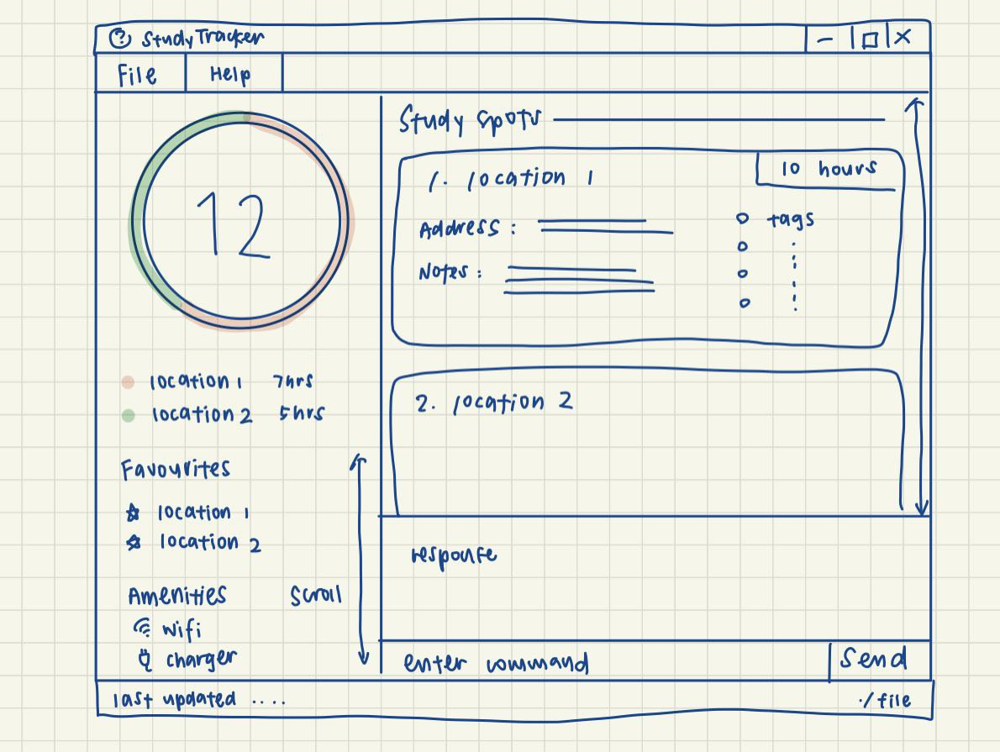

#StudyTracker

## Value proposition 
Allows students to easily track different study areas that they have visited, and will allow them to sort and remember different places they have studied at.

## Features
1. Help 
2. Add a new study spot
3. Show all study spots in the user's list 
4. Edit details of a single study spot
5. Search the list of study spots for spots that contain the search query 
6. Deletes a specified study spot from the list
7. Clears all study spots from saved user data

### Acknowledgement
StudyTracker is an application developed based on the `AddressBook Level 3` application created by the [SE-EDU initiative](https://se-education.org).

