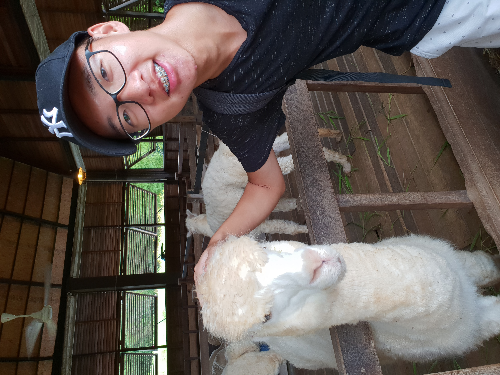

We are a team based in the [School of Computing, National University of Singapore](http://www.comp.nus.edu.sg).

## Project team

### Owen Tan

[[github](https://github.com/mslevis)]

* Responsibility: Integration

### Lim Danqi

[[github](https://github.com/limdanqi)]

* Responsibility: Testing

### Jefferson Lim

[[github](http://github.com/qreoct)][[portfolio](team/qreoct.md)]

* Responsibilities: Team lead, documentation

### Kim-Chan Tze Yong, Joenz

[[github](http://github.com/joenzkimchan)]

* Responsibilities: Code quality, Sourcetree 

### Yin Ruoyan

[[github](http://github.com/ruoyann)]

* Responsibilities: Deliverables, Deadlines 
