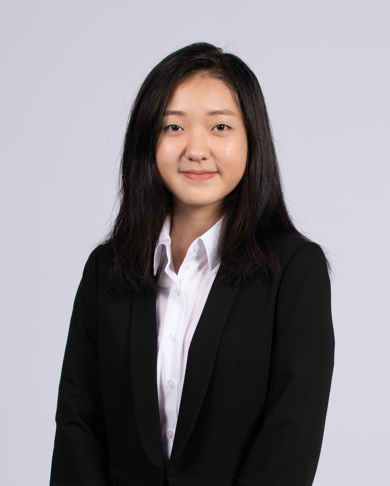

We are a team based in the [School of Computing, National University of Singapore](http://www.comp.nus.edu.sg).

You can reach us at the email `seer[at]comp.nus.edu.sg`

## Project team

### Owen Tan

[[github](https://github.com/mslevis)]

### Lim Danqi

[[github](https://github.com/limdanqi)]

* Role: Developer

### Jefferson Lim

[[github](http://github.com/qreoct)] [[portfolio](team/johndoe.md)]

* Role: Developer
* Responsibilities: Data

### Yin Ruoyan 

[[github](http://github.com/ruoyann)]
[[portfolio](team/johndoe.md)]

* Role: Developer
* Responsibilities: UI

### Kim-Chan Tze Yong, Joenz

[[github](http://github.com/joenzkimchan)]
[[portfolio](null)]

* Role: Gojou Satoru
* Responsibilities: To be confirmed 
