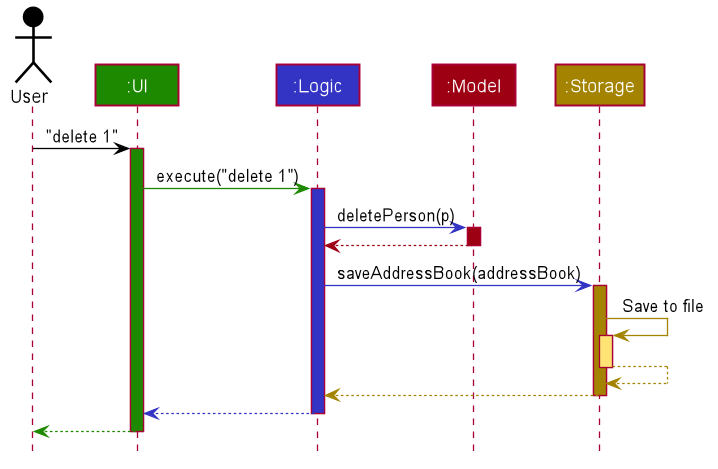
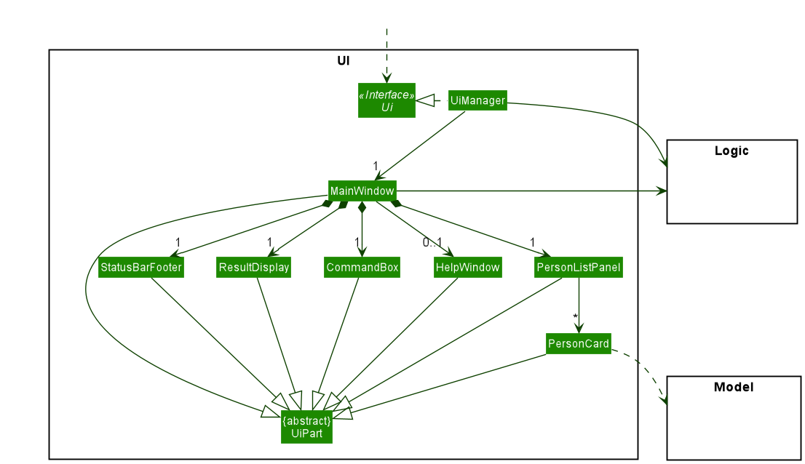
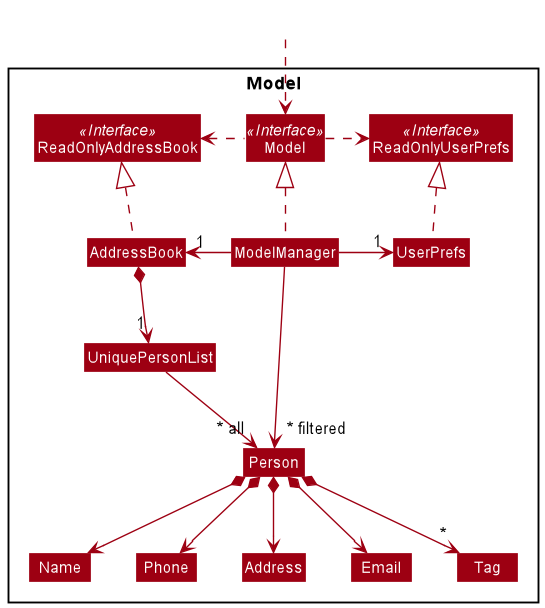
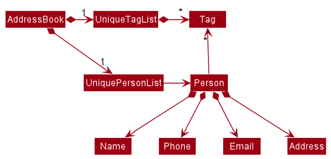
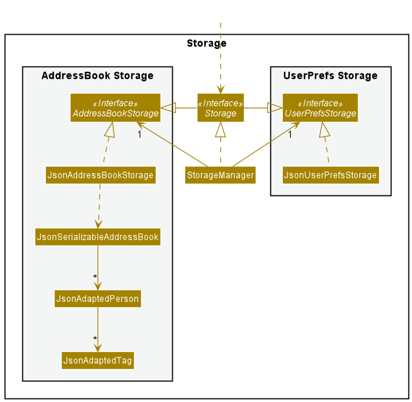

StudyTracker is a **desktop app** that **tracks your most productive study spots**, optimized for students who are familiar with **Command Line Interface (CLI)**.

After reading this **Developer Guide**, you will:

1. be familiarized with the code base of StudyTracker
2. understand the functional and non-functional requirements of the app
3. understand how certain features work and their design considerations

This **Developer Guide** assumes that developers are familiar with **Java 8**, **JavaFX**, **UML Diagrams**, and **Object Oriented Programming Principles**.

Only want to know how to use StudyTracker? Check out the [**User Guide**](UserGuide.html) instead.

--- 

## **Table of Contents**

* Table of Contents
{:toc}

---

## **Acknowledgements**

* Libraries used: [JavaFX](https://openjfx.io/), [Jackson](https://github.com/FasterXML/jackson), [JUnit5](https://github.com/junit-team/junit5)
* StudyTracker is an application developed based on the `AddressBook Level 3` application created by the [SE-EDU initiative](https://se-education.org).
* Graphics acknowledgements can be found [here](https://github.com/AY2122S1-CS2103T-T09-1/tp/blob/master/copyright.txt)

--------------------------------------------------------------------------------------------------------------------

## **Setting up, getting started**

To set up your development environment for StudyTracker, refer to this guide [_Setting up and getting started_](SettingUp.md).

--------------------------------------------------------------------------------------------------------------------

## **Design**

This segment introduces the general architecture of StudyTracker.

:bulb: **Tip:** The `.puml` files used to create diagrams in this document can be found in the [diagrams](https://github.com/se-edu/addressbook-level3/tree/master/docs/diagrams/) folder. Refer to the [_PlantUML Tutorial_ at se-edu/guides](https://se-education.org/guides/tutorials/plantUml.html) to learn how to create and edit diagrams.

### Architecture

The ***Architecture Diagram*** given above explains the high-level design of the App.

Given below is a quick overview of main components and how they interact with each other.

**Main components of the architecture**

**`Main`** has two classes called [`Main`](https://github.com/AY2122S1-CS2103T-T09-1/tp/blob/master/src/main/java/seedu/address/Main.java) and [`MainApp`](https://github.com/AY2122S1-CS2103T-T09-1/tp/blob/master/src/main/java/seedu/address/MainApp.java). It is responsible for,
* At app launch: Initializes the components in the correct sequence, and connects them up with each other.
* At shut down: Shuts down the components and invokes cleanup methods where necessary.

[**`Commons`**](#common-classes) represents a collection of classes used by multiple other components.

The rest of the App consists of four components.

* [**`UI`**](#ui-component): The UI of the App.
* [**`Logic`**](#logic-component): The command executor.
* [**`Model`**](#model-component): Holds the data of the App in memory.
* [**`Storage`**](#storage-component): Reads data from, and writes data to, the hard disk.

**How the architecture components interact with each other**

The *Sequence Diagram* below shows how the components interact with each other for the scenario where the user issues the command `delete n/Central Library`.

Each of the four main components (also shown in the diagram above),

* defines its *API* in an `interface` with the same name as the Component.
* implements its functionality using a concrete `{Component Name}Manager` class (which follows the corresponding API `interface` mentioned in the previous point.

For example, the `Logic` component defines its API in the [`Logic.java`](https://github.com/AY2122S1-CS2103T-T09-1/tp/blob/master/src/main/java/seedu/address/logic/Logic.java) interface and implements its functionality using the [`LogicManager.java`](https://github.com/AY2122S1-CS2103T-T09-1/tp/tree/master/src/main/java/seedu/address/logic) class which follows the `Logic` interface.
Other components interact with a given component through its interface rather than the concrete class (reason: to prevent outside component's being coupled to the implementation of a component), as illustrated in the (partial) class diagram below.

The sections below give more details of each component.

### UI component

The **API** of this component is specified in [`Ui.java`](https://github.com/AY2122S1-CS2103T-T09-1/tp/tree/master/src/main/java/seedu/address/ui/Ui.java)

The UI consists of a `MainWindow` that is made up of parts e.g.`CommandBox`, `ResultDisplay`, `StudySpotListPanel`, `StatusBarFooter` etc. All these, including the `MainWindow`, inherit from the abstract `UiPart` class which captures the commonalities between classes that represent parts of the visible GUI.

The `UI` component uses the JavaFx UI framework. The layout of these UI parts are defined in matching `.fxml` files that are in the `src/main/resources/view` folder. For example, the layout of the [`MainWindow`](https://github.com/se-edu/addressbook-level3/tree/master/src/main/java/seedu/address/ui/MainWindow.java) is specified in [`MainWindow.fxml`](https://github.com/se-edu/addressbook-level3/tree/master/src/main/resources/view/MainWindow.fxml)

The `UI` component,

* executes user commands using the `Logic` component.
* listens for changes to `Model` data so that the UI can be updated with the modified data.
* keeps a reference to the `Logic` component, because the `UI` relies on the `Logic` to execute commands.
* depends on some classes in the `Model` component, as it displays `StudySpot` object residing in the `Model`.

### Logic component

**API** : [`Logic.java`](https://github.com/AY2122S1-CS2103T-T09-1/tp/blob/master/src/main/java/seedu/address/logic/Logic.java)

Here's a (partial) class diagram of the `Logic` component:

How the `Logic` component works:
1. When `Logic` is called upon to execute a command, it uses the `StudyTrackerParser` class to parse the user command.
1. This results in a `Command` object (more precisely, an object of one of its subclasses e.g., `AddCommand`) which is executed by the `LogicManager`.
1. The command can communicate with the `Model` when it is executed (e.g. to add a `StudySpot`).
1. The result of the command execution is encapsulated as a `CommandResult` object which is returned from `Logic`.

The Sequence Diagram below illustrates the interactions within the `Logic` component for the `execute("delete n/Central Library")` API call.

:information_source: **Note:** The lifeline for `DeleteCommandParser` should end at the destroy marker (X) but due to a limitation of PlantUML, the lifeline reaches the end of diagram.

Here are the other classes in `Logic` (omitted from the class diagram above) that are used for parsing a user command:

How the parsing works:
* When called upon to parse a user command, the `StudyTrackerParser` class creates an `XYZCommandParser` (`XYZ` is a placeholder for the specific command name e.g., `AddCommandParser`) which uses the other classes shown above to parse the user command and create a `XYZCommand` object (e.g., `AddCommand`) which the `StudyTrackerParser` returns back as a `Command` object.
* All `XYZCommandParser` classes (e.g., `AddCommandParser`, `DeleteCommandParser`, ...) inherit from the `Parser` interface so that they can be treated similarly where possible e.g, during testing.

### Model component
**API** : [`Model.java`](https://github.com/AY2122S1-CS2103T-T09-1/tp/blob/master/src/main/java/seedu/address/model/Model.java)

The `Model` component,

* stores the study tracker data i.e., all `StudySpot` objects (which are contained in a `UniqueStudySpotList` object).
* stores the currently 'selected' `StudySpot` objects (e.g., results of a search query) as a separate _filtered_ list which is exposed to outsiders as an unmodifiable `ObservableList<StudySpot>` that can be 'observed' e.g. the UI can be bound to this list so that the UI automatically updates when the data in the list change.
* stores a `UserPref` object that represents the user’s preferences. This is exposed to the outside as a `ReadOnlyUserPref` objects.
* does not depend on any of the other three components (as the `Model` represents data entities of the domain, they should make sense on their own without depending on other components)

:information_source: **Note:** An alternative (arguably, a more OOP) model is given below. It has a `Tag` list in the `StudyTracker`, which `StudySpot` references. This allows `StudyTracker` to only require one `Tag` object per unique tag, instead of each `StudySpot` needing their own `Tag` objects. 

### Storage component

**API** : [`Storage.java`](https://github.com/AY2122S1-CS2103T-T09-1/tp/blob/master/src/main/java/seedu/address/storage/Storage.java)

The `Storage` component,
* can save both study tracker data and user preference data in json format, and read them back into corresponding objects.
* inherits from both `StudyTrackerStorage` and `UserPrefStorage`, which means it can be treated as either one (if only the functionality of only one is needed).
* depends on some classes in the `Model` component (because the `Storage` component's job is to save/retrieve objects that belong to the `Model`)

### Common classes

Classes used by multiple components are in the `seedu.address.commons` package.

---

## **Implementation**

This section describes some noteworthy details on how certain features are implemented.

 
### Alias feature

#### Overview

The Alias command supports user-defined aliases for commands.
These aliases are string values that will be replaced by commands (i.e. *command expansion*) during the execution of command.

Aliases are stored in the `UserPrefs` object.

#### Key terms

* **Aliases** — A user-specified string that is mapped to a **command**.
  Aliases **cannot** be defined to existing command words.
* **Commands** — A command must contain exactly one command word, all compulsory arguments and optional arguments if 
  indicated. 
  When executed, an action is performed.
* **Command Words** — The main "verbs" representing commands in StudyTracker.
  A command word by itself is a **command**.
  
  Example: `list`, `edit`, `find` are command words.

* **Well-formed command** — A command is well-formed if it has exactly one command word (or alias) and optional arguments.

    Examples:
  
    * `list` - well-formed
    * `add n/Starbucks`  —  well-formed, since it contains command word `add` and argument `n/Starbucks`.
    However, it is invalid (i.e. will throw and error when executed), since it is missing required argument `rating`.
    * `myAdd t/cold`  —  well-formed, since it contains alias `myAdd` and argument `t/cold`.
  `myAdd` will itself expand to another well-formed command (by definition of Alias).
    * `add list find n/Starbucks r/5`  —  not well-formed, since it has 3 command words (only should have one).
    * `myAdd add n/Starbucks r/5`  —  not well-formed, since it has both 1 alias and 1 command word (only should have one).

#### Implementation of Alias feature

The Alias feature is facilitated by three key classes: `Alias.java`, `StudyTrackerParser.java`, and `UserPrefs.java`.

`Alias.java` is responsible for creating new Aliases. It implements the following operations:

* `Alias#isValidUserAlias()` — checks if Alias is valid (i.e whether it is a command word)
* `Alias#isValidCommandWord()` — checks if Alias maps to a valid command word in the StudyTracker list of commands.

`StudyTrackerParser.java` is responsible for parsing user commands. The key operations needed for Aliases are:

* `StudyTrackerParser#isInvokingAlias()` —  checks if the user input is a normal command, or one that invokes an Alias belonging in `UserPrefs`.  
* `StudyTrackerParser#expandAlias()` —  parses the Alias into its corresponding command.
StudyTrackerParser will prepend the arguments from the expanded command before the arguments in user input, if any.

`UserPrefs.java` is responsible for storing and reading Aliases from disk. The key operations needed for Aliases are:
* `UserPrefs#getUserAliases()` — Returns the list of Aliases defined by the user. 
* `UserPrefs#setUserAliases()` — Saves the current list of Aliases defined by the user.

Given below is an example usage scenario and how the Alias feature behaves at each step.

**Step 1.** The user launches the application for the first time. The program loads with default Aliases.

**Step 2.** The user executes `alias al/myAdd cmd/add r/5 n/` which creates an alias `myAdd` with command `add r/5 n/`.
The `alias` command calls `Model#addAlias()`, adding this newly created alias to the Model and in UserPrefs.

:information_source: 
**Note:** Observe how the command is incomplete!
It is a well-formed command, but requires the completion of the `n/` argument to be valid.

However, this is allowed, as it is one of the key features for the flexibility of the Alias feature.

**Step 3.** The user executes `myAdd Starbucks t/cold` to add a new study spot.
Within `StudyTrackerParser`, alias parsing takes place by fetching user alias information in `Model`.

The command is expanded to `add r/5 n/Starbucks t/cold`.
The string is then passed to the corresponding `AddCommandParser`, and an `AddCommand` is created.

The following sequence diagram demonstrates how StudyTrackerParser parses the input with this new `myAdd` alias:

:information_source:
**Note:** If a command fails its execution, the respective CommandParser will throw a `ParseException`.

:information_source:
**Note:** This sequence diagram does not show the subsequent execution of the created AddCommand.

The following activity diagram summarizes what happens when a user executes a new command:

#### Design considerations

**Aspect: What aliases should be allowed:**

* **Alternative 1:** Aliases only map to a single command word.
    * Pros: Easy to implement.
    * Cons: Not particularly useful for the user.

* **Alternative 2 (current choice):** Aliases can map to commands, not just command words.
    * Pros: User has more freedom to implement powerful commands.
    * Cons: Implementation is slightly more challenging.
    
* **Alternative 3:** Aliases can map to commands, including other aliases.
    * Pros: User has even more freedom.
    * Cons: Implementation is much more challenging (e.g. how to prevent recursion?).

### Log feature

#### Overview

The number of hours that a user spends at a StudySpot is shown on the GUI. It is saved as a field of `StudySpot`, known
as `StudiedHours`. This number can be changed by making use of the Log feature.

#### Implementation of Log feature

The Log feature is facilitated by `LogCommand.java`, `StudiedHours.java`.

`StudiedHours.java` is a statistical field in `StudySpot`. It is responsible for storing the hours a user studies at a
StudySpot. It implements the following operations: 
- `StudiedHours#isValidLoggedHours()` -- checks if a given input in a Log Command is a positive integer, and that there
is no integer overflow.
- `StudiedHours#addHours(StudiedHours toBeAdded)` -- Takes in another `StudiedHours` and adds the two values
 together, returning a new `StudiedHour`. It also ensures that there is no integer overflow.

`LogCommand.java` is responsible for changing the `StudiedHours` field in a given `StudySpot` (given by its `Name`). 
It has 4 different ways of doing so:
- By default, it adds the given input value to the current value.
    - E.g. If the current StudiedHours is 4, and the user logs 3 more hours, it adds 4 and 3 together to give 7 hours.
- By using the `-o` flag in the input, it **overrides** the original value and replaces it with the given value.
    - E.g. If the current StudiedHours is 4, and the user logs 3 with the `-o` flag, it will override the existing 4
      and replace it with 3.
- By using the `-r` flag in the input, it **resets** the original value to 0.
    - E.g. If the current StudiedHours is 4, and the user logs with the `-r` flag, the value will be reset to 0.
- By using the `-ra` flag in the input, it **resets** the original value of ALL `StudySpot`'s to 0.
    - E.g. If the user logs with the `-ra` flag, all values will be reset to 0.

    
Given below is an example usage scenario and how the Log feature behaves at each step:

Step 1. The user launches the application. The program loads with the given `StudySpot`'s.

Step 2. The user executes `log -r n/Starbucks UTown` which resets the `StudiedHours` at Starbucks to 0.

Step 3. After studying for 3 hours at Starbucks, the user executes `log n/Starbucks UTown hr/5`, which adds 5 hours to 0,
 resulting in the `StudiedHours` to become 5.

Step 4. The user realises he made a mistake, and executes `log -o n/Starbucks UTown hr/3`, which hard changes the 
`StudiedHours` to 3.
   
Step 5. The user wants to reset all `StudiedHours` to 0, so the user executes the command `log -ra`.
   
The following sequence diagram demonstrates the flow from the given input:

Sequence diagram for `-r` flag is the same as `-o` but with handleReset() instead of handleOverride()

The following activity diagram summarizes what happens when a user executes a new command:

#### Design considerations

Initially, Log Command was designed for users to keep track of how long they studied somewhere, and was supposed to 
only add the value provided by the user to the current value (which is the default behaviour of the log command).

Some things were considered while implementing the Log Command:
1. What if a user enters an incorrect input?
2. What happens if there is an integer overflow for the number of hours?
3. Should users be able to change logged hours with Edit command?

To tackle these issues, the following solutions were implemented:
1. Introduction of flags
    - Two useful flags, `-o` for override, and `-r` for reset.
    - Use of these flags will result in a simpler solution that is user-friendly too.
2. Limiting the number of hours that each `StudySpot` can hold
    - Prohibiting the addition of hours exceeding `INTEGER_MAX_VALUE`, which is already an unreasonable 
      amount of hours to be studying anyway.
    - Furthermore, if a user wishes to log more hours while already having `INTEGER_MAX_VALUE`hours at a location,
    it will prompt the user to use either `-o` or `-r` to set or reset the value.
3. Disallowing Edit to change logged hours
    - Log is intended to be a command for users to use at the end of a study session at a study spot, if they wish
    to keep track of how long they studied there.
    - Using Edit on `StudiedHours` should provide a similar effect to the `-o` flag of Log, it was agreed that it was
     not natural and unintuitive to use Edit for this purpose.

### Operating Hours
#### Overview

Operating hours allow users to specify the opening and closing hours of a study spot.

#### Implementation

Operating hours is facilitated by these classes: `OperatingHours.java`, `StudySpot.java`, `AddCommand.java`
and `EditCommand.java`.

`OperatingHours.java` is responsible for creating `OperatingHours` objects. A `StudySpot` object contains 
an `operatingHours` attribute. A study spot with an `OperatingHours` object can be initialised with an Add command 
or the `operatingHours` attribute can be edited with an Edit command.

Given below is an example usage scenario of adding a study spot with operating hours and how the mechanism behaves.

Step 1. The user executes `add n/com r/5 o/0900-2200, 0900-1800` to add a new study spot. `StudyTrackerParser` class
creates an `AddCommandParser` to parse the command. Since operating hours are provided in the command, 
`ParserUtil#parseOperatingHours(String operatingHours)` is called. An `AddCommand` object with the study spot to be 
added is then created.

The following object diagram illustrates the `OperatingHours` object created.

Step 2. `LogicManager` executes the `AddCommand` object, calling `Model#addStudySpot(StudySpot studySpot)` so that 
a new study spot is added to the model in StudyTracker.

The following sequence diagram demonstrates how `StudyTrackerParser` parses the command.

### Amenities 
#### Overview

Users are able to add amenities such as wifi, food, aircon and charger to a study spot.

#### Implementation

Amenity is facilitated by these classes: `Amenity.java`, `StudySpot.java`, `AddCommand.java` and `EditCommand.java`.

`Amenity.java` is responsible for creating `Amenity` objects. A `StudySpot` object contains
an `amenities` attribute. A study spot with an `Amenity` object can be initialised with an Add command
or the `amenities` attribute can be edited with an Edit command.

Given below is an example usage scenario of adding a study spot with the wifi amenity and how the mechanism behaves.

Step 1. The user executes `add n/COM1 r/5 m/wifi` to add a new study spot. `StudyTrackerParser` class
creates an `AddCommandParser` to parse the command. Since an amenity is provided in the command,
`ParserUtil#parseAmenity(String amenity)` is called. An `AddCommand` object with the study spot to be
added is then created.

Step 2. `LogicManager` executes the `AddCommand` object, calling `Model#addStudySpot(StudySpot studySpot)` so that
a new study spot is added to the model in StudyTracker.

The following sequence diagram demonstrates how `StudyTrackerParser` parses the command.

### Enhanced List Command
#### Overview

The List Command is enhanced to support filtering of favourites, tags, amenities and rating.

#### Implementation

The `Model` component stores the currently 'selected' `StudySpot` objects as a separate filtered list. The filter of this list can be updated using `Model#updateFilteredStudySpotList(Predicate<StudySpot> predicate)`.

The following activity diagram outlines the general parsing and execution of a ListCommand.

Upon entering a command, the user's input command is parsed and a `ListCommandParser` is created. 
The parser looks out for flags given in the user's input and checks if the associated parameters are given correctly
`ListCommandParser` then creates a `ListCommand` object with a `Predicate<StudySpot>` that tests for 
the specified conditions by the user. `Logic Manager` proceeds to execute `ListCommand` and a `CommandResult` object
is created. The result is returned to `Logic Manager`.

Given below is an example usage scenario and how the list mechanism behaves at every step.

Step 1. The user executes `list -f` command to show all favourites in the StudyTracker. `StudyTrackerParser` class
creates a `ListCommandParser` to parse the command and creates a `ListCommand` object with a `Predicate<StudySpot>`
that filters for favourite `StudySpots`.

Step 2. `LogicManager` executes the `ListCommand` object, calling 
`Model#updateFilteredStudySpotList(Predicate<StudySpot> predicate)`. This updates the model in StudyTracker to show
only favourite `StudySpots` to the user. 

The following sequence diagram demonstrates how `StudyTrackerParser` parses the command.

#### Design considerations

**Behaviour of filters with multiple tags:**
* **Alternative 1 (current choice):** Filtering by tags show study spots that all specified tags.
* **Alternative 2:** Filtering by tags show study spots that contain at least one of the specified tags.

The current choice was chosen as it is intuitive and most modern desktop applications follow this behaviour. 

### Enhanced Edit Command

#### Overview

The Edit Command is enhanced to support the removal of specific tags and amenities.

#### Implementation

The Edit Command is facilitated by two classes: `EditCommand.java` and `EditCommandParser.java`.

Given below is an example usage scenario of removing a tag from a study spot and how the mechanism behaves.

Step 1. The user executes `edit spot/com rt/noisy` to remove the Tag `noisy` from the StudySpot `com`. 
`StudyTrackerParser` then parses this input and creates an `EditCommand` object.

Step 2. `LogicManager` executes the `EditCommand` object and updates the model in StudyTracker with the edited study
spot.

The following sequence diagram demonstrates how `StudyTrackerParser` parses the command.

#### Design considerations

**Aspect: How to increase the ease of removing fields in a study spot:**
- **Alternative 1 (current choice)**: Users can directly remove a tag or an amenity they specify.
- **Alternative 2**: Users have to retype existing tags or amenities if they wish to retain them.

### Themes

#### Overview

Themes allow users to customize the colours of the GUI of StudyTracker.

#### Implementation of Themes

The GuiSettings class handles information about GUI width, height, position, and theme.
These settings are stored by `UserPrefs` in the Model.

Themes are stored as Strings representing the theme name.
For example, `"default"` represents the default theme.

The `MainWindow` Ui component communicates with the Logic class to read and write the currently selected theme.
Then, the `MainWindow` takes the stored theme and injects the corresponding CSS file to set the colours of the JavaFX app.

In the example, `"default"` will be parsed to `ThemeDefault.css`, which is injected into the JavaFX stage.

The following activity diagram summarizes the process of customizing themes.

#### Themes style guide

Each theme file is named `Theme[Themenamesentencecase].css`

It contains 8 theme colours, utilizing CSS variables support of JavaFX.

The following are examples showing the `Default` and `DotsDark` theme.

* `-fx-base` — base colour of the theme and StudyTracker GUI
* `fg-surface` — surface colour to place primary content
* `bg-surface` — surface colour to place secondary content
* `fg-accent` — contrasting colour to act as accenting colour
* `fg-text`, `bg-text`, `accent-text` — text colour for `fg-surface`, `bg-surface` and `fg-accent` respectively.
* `button` — button colour

---

## **Documentation, logging, testing, configuration, dev-ops**

* [Documentation guide](Documentation.md)
* [Testing guide](Testing.md)
* [Logging guide](Logging.md)
* [Configuration guide](Configuration.md)
* [DevOps guide](DevOps.md)

---

## **Appendix: Requirements**

### Product scope

**Target user profile**:

* computing students that wants to track their study areas
* prefer desktop apps over other types
* can type fast
* prefers typing to mouse interactions
* is reasonably comfortable using CLI apps

**Value proposition**: manage study spots faster than a typical mouse/GUI driven app

### User stories

Priorities: High (must have) - `* * *`, Medium (nice to have) - `* *`, Low (unlikely to have) - `*`

| Priority | As a …​                                    | I want to …​                     | So that I can…​                                                        |
| -------- | ------------------------------------------ | ------------------------------ | ---------------------------------------------------------------------- |
| `* * *`  | new user                                   | see usage instructions         | refer to instructions when I forget how to use the App                 |
| `* * *`  | user                                       | add a new study spot               |                                                                        |
| `* * *`  | user                                       | delete a study spot                | remove entries that I no longer need                                   |
| `* * *`  | user                                       | find a study spot by name          | locate details of study spots without having to go through the entire list |
| `* *`    | user with limited mobile data                                       | track wifi availability   | know which study spot has wifi                |
| `* *`    | user                                       | track food availability   | know which study spot has food                |
| `* *`    | user                                       | track air conditioner availability   | know which study spot has air conditioner                |
| `* *`    | user                                     | rate a study spot   | recall previous experiences at the study spot                |
| `* *`    | user                                     | favourite a study spot   | know my preferred study spot                |
| `*`      | user with many study spots in the study tracker | sort study spots by name           | locate a study spot easily                                                 |
| `*`      | user with multiple devices | save data into a user-specified text file           | transfer my data between devices                                                |
| `*`      | user with multiple devices | import data from a user-specified text file           | transfer my data between devices                                                |

### Use cases

(For all use cases below, the **System** is the `StudyTracker` and the **Actor** is the `user`, unless specified otherwise)

**UC01 - Delete a study spot**

**MSS**

1.  User requests to list study spots
2.  StudyTracker shows a list of study spots 
3.  User requests to delete a specific study spot in the list
4.  StudyTracker deletes the study spot 

    Use case ends.

**Extensions**

* 2a. The list is empty.

  Use case ends.

* 3a. The given index is invalid.

    * 3a1. StudyTracker shows an error message.

      Use case resumes at step 2.

**UC02 - Add and use an alias**

**MSS**

1. User requests to add an alias
2. StudyTracker adds the custom alias 
3. User uses the alias
4. StudyTracker parses the alias into its intended command, and executes that command.

    Use case ends.

**Extensions**
* 1a. Alias is already defined.
    * 1a1. StudyTracker will overwrite the existing definition
    
      Use case resumes at step 2.
* 1b. The given alias is invalid.
    * 1b1. StudyTracker shows an error message.
    
      Use case resumes at step 1.
* 4a. Command executes with error.
    * 4a1. StudyTracker shows an error message.
      
      Use case ends.

**UC03 - List by favourites**

**MSS**

1. User requests to view list by favourites.
2. StudyTracker shows all favourite study spots.

   Use case ends.

**Extensions**
* 1a. Invalid flag is given
    * 1a1. StudyTracker shows an error message.

      Use case ends.

    
### Non-Functional Requirements

1.  Should work on any _mainstream OS_ as long as it has Java `11` or above installed.
2.  Should work without requiring an installer.
3.  Should not depend on remote servers.
4.  Should have automated test coverage for >70% of the codebase.
5.  Should have GUI that is _usable_ for screen resolutions 1280x720 and higher.
6.  Should have documentation for users to get them familiar with the basics of the program.
7.  Should have documentation for potential developers to get them familiar with the basics of developing the program.
8.  Should be able to save user data into human-readable and human-editable text files.
9.  Should be able to hold up to 1000 study spots without a noticeable sluggishness in performance for typical usage.
10. Should be designed for use by a single user
11. A user with above average typing speed for regular English text (i.e. not code, not system admin commands) should be able to accomplish most of the tasks faster using commands than using the mouse.
12. StudyTracker is offered as a Free, Open Source Software (FOSS) program, licensed under the MIT License.

### Glossary

* **Mainstream OS**: Windows, Linux, Unix, OSX
* **Private contact detail**: A contact detail that is not meant to be shared with others
* **Usable**: All functions can be used even if the user experience is not optimal

---

## **Appendix: Instructions for manual testing**

Given below are instructions to test the app manually.

:information_source: **Note:** These instructions only provide a starting point for testers to work on;
testers are expected to do more *exploratory* testing.

### Launch and shutdown

1. Initial launch

    1. Download the jar file and copy into an empty folder.

    1. Double-click the jar file. 
       Expected: Shows the GUI with a set of sample study spots.
       The window size may not be optimum.

1. Saving window preferences

    1. Resize the window to an optimum size. Move the window to a different location. Close the window.

    1. Re-launch the app by double-clicking the jar file. 
       Expected: The most recent window size and location is retained.
       
1. Saving custom themes

    1. Set a colour theme in the Settings by accessing `File > Settings` in the Menu Bar and selecting a Theme.
    
    1. Click on `Save` to apply this theme. 
       Expected: The GUI will change colour to the selected theme. 
       
    1. Close the window.
       
    1. Re-launch the app by double-clicking the jar file. 
       Expected: The GUI will launch with the selected theme.

       
### Adding a study spot

1. Adding a study spot to StudyTracker

    1. Prerequisites: Do not have a study spot named 'Test Spot' already in StudyTracker

    1. Test case: `add n/Test Spot r/5 m/wifi a/Testing` 
       Expected: A study spot named Test Spot, with rating 5, amenity [wifi], address: "Testing" is added to the list.
       Details of the added study spot is shown in the status message.
       The study spot is also displayed in the GUI (might require scrolling down the list of study spots).
       
    1. Test case: `add n/Test Spot r/3` 
       Expected: No study spot is added as there already exists a study spot named 'Test Spot'.
       Error details shown in the status message. 

    1. Other incorrect add commands to try: `add New Place`, `add n/New Place` 
       Expected: Error messages for invalid command format is shown.

### Deleting a study spot

1. Deleting a study spot while all study spots are being shown

    1. Prerequisites: Have at least 1 study spot in the list. 

    1. Test case: `delete n/Central Library` 
       Expected: The study spot named Central Library is deleted from the list. Details of the deleted study spot shown in the status message.

    1. Test case: `delete n/INVALID` 
       Expected: No study spot is deleted as there does not exist a study spot named 'INVALID'. Error details shown in the status message. Similar error message will show if user tries to delete a study spot that does not exist in the list. 

    1. Other incorrect delete commands to try: `delete Central Library`, `delete spot/Central Library` 
       Expected: Similar to previous.

### Adding and using aliases

1. Adding a custom alias
    1. Test case:
        1. `alias al/myAdd cmd/add r/5 n/`
        1. `myAdd myPlace` 
    
        Expected: A new study spot 'myPlace' with rating 5 is added.
        Details of this new study spot is shown in the GUI. (i.e. the Add command has been executed successfully).
       
   1. Test case:
        1. `myAdd`
        
        Expected: No study spot is added. (i.e. the Add command is missing parameters).
        Error details shown in the status message.
      
1. Overwriting an existing alias
   1. Test case:
        1. `alias al/myAdd cmd/list`
        1. `myAdd`
    
        Expected: All study spots are listed (i.e. the List command has been executed successfully)
    
1. Removing an alias
    1. Test case:
        1. `unalias al/myAdd`
        1. `myAdd`
    
        Expected: Unknown command execution.
        Error details  shown in the status message.

       
### Logging hours at a study spot

1. Logging hours studied at a study spot

    1. Prerequisites: Have a study spot named 'Test Spot' already in StudyTracker with 0 hours logged.
       Refer to Test case *"Adding a study spot"* for steps to achieve this.

    1. Test case: `log n/Test Spot hr/25` 
       Expected:
       - The study spot named Test Spot will get 25 hours logged to it.
       - The Hours Studied section of the card will be updated to show "25 hours".
       - The Hours Studied pie chart will update total hours with 25 additional hours.
       - The Hours Studied pie chart will have a segment for Test Spot with 25 hours, which shows on mouseover.
       
    1. Test case: `add log -ra` 
       Expected: The studied hours are reset from all study spots.
       The Hours Studied pie chart will not show, and total hours for all study spots are 0.
