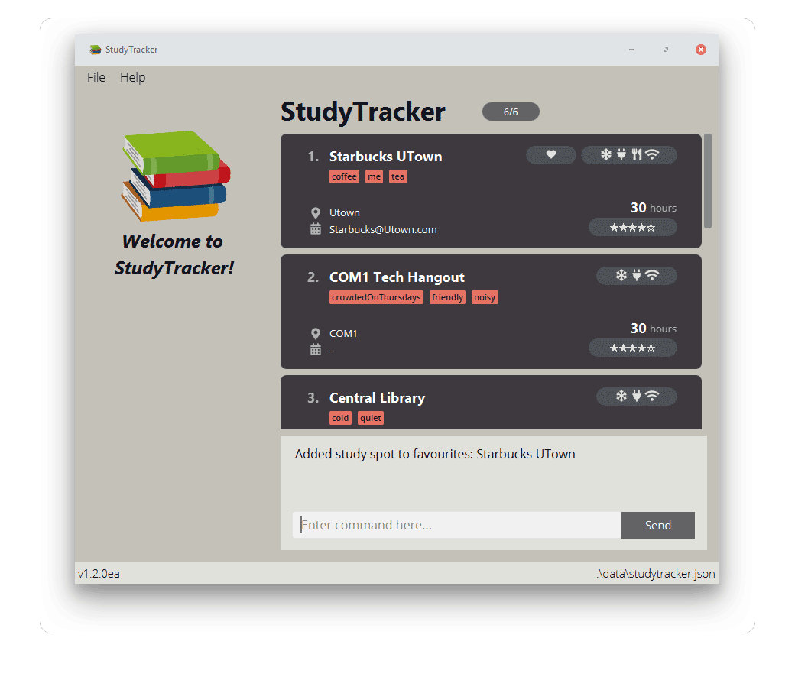

StudyTracker is a **desktop app** that **tracks your most productive study spots**, optimized for **Command Line Interface (CLI) users.**

With detailed data recording, and statistics of study time & effectiveness,
**StudyTracker aims to maximise your productivity by making it easy to find the best place to study.**

## Table of Contents

* Table of Contents
{:toc}

---

## Quick start

StudyTracker comes with sample data.
Let's explore how to add a new study spot and track our study time with it!

1. Ensure you have Java `11` or above installed in your Computer.

1. Download the latest `StudyTracker.jar` from [here](https://github.com/AY2122S1-CS2103T-T09-1/tp/releases).

1. Copy the file to the folder you want to use as the _home folder_ for your StudyTracker.

1. Double-click the file to start the app. The GUI similar to the one below should appear in a few seconds. Note how the app contains some sample data.<br>
   

1. Type the command in the command box and press Enter to execute it. e.g. typing **`help`** and pressing Enter will open the help window.<br>
   Some commands you can try:

   1. **`list`** : Lists all study spots.
    Study spots are shown in cards on the right panel of the program.

   1. **`add`** `n/COM1 r/5 m/aircon` : Adds a study location named `COM1`, with a rating of 5 and 'aircon' amenity to the StudyTracker.
    You'll see it if you scroll down the list of study locations!

   1. **`log`** `n/COM1 h/3` : Logs 3 hours of study time at `COM1`.
    The study hours should be reflected on the card.

   1. **`exit`** : Exits the app.

1. Refer to the [Features](#features) below for more commands and features!

---
## Command Syntax

**Throughout the User Guide, you'll see commands to enter into StudyTracker.
Here is how to read the command format:**

### Command Structure
Commands use a multipart structure that must be specified in this order:
1. **Command word** which may be user-created aliases (detailed further in [Aliases](#setting-command-aliases--alias-unalias)). <br>
2. **Parameters** and **Flags**

```
 <COMMAND> [parameters and flags]
 ```

### Flags

Commands may require **flags**.
  Flags are represented by a dash, and a sequence of characters. <br>
  e.g. the `list` command has a `-f` flag to list only favourites.

### Parameters

* Each parameter may have a delimiter. <br>
e.g. the `NAME` parameter has a delimiter `n/` and the `AMENITY` parameter has a delimiter `m/`.
  
* Words in `UPPER_CASE` are the parameters to be supplied by the user.<br>
  e.g. in `add n/NAME*`, `NAME` is a parameter which can be used as `add n/COM1 Basement`.

* Parameters with an asterisk `*` are **required** while those without an asterisk are optional.<br>
  e.g `n/NAME* m/AMENITY...` can be used as `n/COM1 Basement m/wifi` or as `n/COM1 Basement`.

* Parameters with `…`​ after them can be used multiple times including zero times.<br>
  e.g. `t/TAG...​` can be used as ` ` (i.e. 0 times), `t/noisy`, `t/mosquitos t/sunny` etc.

* Parameters can be in any order.<br>
  e.g. if the command specifies `n/NAME* a/ADDRESS`, `a/ADDRESS n/NAME*` is also acceptable.

<div markdown="block" class="alert alert-warning">:exclamation: **Note:**

* If a parameter is expected only once in the command, but you specified it multiple times, only the **last occurrence** of the parameter will be taken.<br>
  e.g. if you specify `n/COM1 n/CLB`, only `n/CLB` will be taken.

* Extraneous parameters for commands that do not take in parameters (such as `help`, `list`, `exit` and `clear`) will be ignored.<br>
  e.g. if the command specifies `help 123`, it will be interpreted as `help`.
</div>


### Examples
Some **valid** user inputs for the *add command* are provided below:
* `add n/PC Commons a/UTown t/veryCrowded m/toilet r/4`
* `add n/COM2 Basement r/3` (optional arguments are not required)
* `add n/TR3 a/Yusof Ishak House m/wifi m/aircon` (multiple amenities are acceptable)

Some **invalid** user inputs for the *add command* are provided below:
* `add n/PC Commons` (missing `RATING` parameter)
* `add PC Commons /UTown /very crowded /toilet /4*` (delimiters and slashes missing from parameters, unnecessary asterisk added outside of parameters)
* `n/PC Commons a/UTown r/4` (missing command word `add`)


## GUI Features

This section introduces the Graphical User Interface (GUI) of StudyTracker.


On the right side of the interface, the **Study Spot List** and **Command Box** can be found.

The **Study Spot List** contains **Cards** representing every study spot in StudyTracker.
The `Total` tag at the top shows current visible study spots/total number of study spots in StudyTracker.
Scroll down the list to view all the study spots!
* `Name` — name of study spot
* `Tags` — user-defined tags for the study spot
* `Address` — address of study spot
* `Operating Hours` — operating hours of study spot, weekdays and weekends
* `Favourite` — this icon shows if the study spot is added to favourites
* `Amenities` — the icons represent the amenities present in study spot.
From left to right, the amenities are **aircon, charger, food, wifi**.
* `Hours` — total number of hours studied at study spot
* `Rating` — user-defined rating for the study spot

The **Command Box** is where to enter commands in StudyTracker.

* `Command Box` — type in your commands here
* `Display` — results of commands and error messages are shown here.

## Commands

This section introduces all the commands in StudyTracker.

### Viewing help : `help`

Provides a reference for commands in StudyTracker.
You can also visit the User Guide and Developer Guide by clicking on the buttons in the window.


Format: `help`

<div markdown="span" class="alert alert-primary">:bulb: **Tip:**
View the help window anytime by using the F1 shortcut!
Alternatively, click on 'Help' in the menu bar!
</div>

### Adding a study spot: `add`

Adds a study spot to the StudyTracker.

**Format:** `add n/NAME* r/RATING* a/ADDRESS t/TAG... m/AMENITY...`

<div markdown="span" class="alert alert-primary">:bulb: **Tip:**
Tags, amenities and address are all optional.
</div>

**Examples:**
```
add n/COM1 Basement r/5
New study spot added: COM1 Basement

add n/Starbucks at UTown r/4 t/noisy m/wifi
New study spot added: Starbucks at UTown
```

### Listing study spots : `list`

Shows saved study spots in the StudyTracker.

**Format:** `list` to show all study spots

**Format:** `list -f` to show all favourite study spots

**Format:** `list -t t/TAG...` to show study spots with specified tags

<div markdown="span" class="alert alert-primary">:bulb: **Tip:**
Multiple flags can be used at once.
</div>

**Examples:**
```
list 
Listed all study spots
  
list -f -t t/cold
Listed all study spots in Favourites with Tags: [cold]
```

<div markdown="span" class="alert alert-primary">:bulb: **Tip:**
Make use of command aliases to speed up typing your inputs!
</div>

**Command alias:** `ls`

### Editing a study spot : `edit`

Edits the details of a single study spot.

**Format:** `edit spot/NAME* n/NEW_NAME a/NEW_ADDRESS t/NEW_TAG m/NEW_AMENITY r/NEW_RATING`

* Edits the study spot matching `NAME`.
  Provided `NAME` is not case-sensitive and **must fully match the study spot name**.
* At least one of the optional fields must be provided.
* Name, rating, address will be updated.
* When editing tags and amenities, `t/` or `m/` will append to existing tags and amenities.
* You can remove a specific tag or amenity with the `rt/` or `rm/` parameter.
* You can remove all the study spot’s tags by typing `t/` or `m/` without
    specifying any tags after it.

**Examples:**
```
edit spot/tr3 n/Training Room 3
Edited study spot: Training Room 3
```

### Adding a study spot to Favourites: `fav`

Adds a study spot to the StudyTracker's Favourites.

**Format:** `fav n/NAME*`

**Examples:**
```
fav n/COM1 Basement
Added study spot to favourites: COM1 Basement
```

### Removing a study spot from Favourites: `unfav`

Removes a study spot from the StudyTracker's Favourites.

**Format:** `unfav n/NAME*`

**Examples:**
```
unfav n/COM1 Basement
Removed study spot from favourites: COM1 Basement
```

### Locating a study spot by name: `find`

Finds study spots whose names contain any of the given keywords.

**Format:** `find KEYWORD* [MORE KEYWORDS]`

* The search is case-insensitive. e.g `library` will match `Library`
* Only full words will be matched. e.g. `Lib` will not match `Library`
* Study spots matching at least one keyword will be returned.

**Examples:**
```
find library
3 study spot(s) listed!
  1. Central Library
  2. Hon Sui Sen Memorial Library
  3. Jurong Library
```

### Deleting a study spot : `delete`

Deletes the specified study spot from the StudyTracker.

**Format:** `delete n/NAME*`

* Deletes the study spot with the specified **name**.

**Examples:**
```
delete n/COM1
Deleted study spot: COM1
```

### Clearing all entries : `clear`

Clears all entries from the StudyTracker.

<div markdown="span" class="alert alert-primary">:exclamation: **NOTE:**
This command is irreversible!
</div>

**Format:** `clear`

**Example:**
```
clear
All study spots have been cleared
```

### Exiting the program : `exit`

Closes the StudyTracker.

**Format:** `exit`

**Example:**
```
exit
Goodbye!
```

**Command alias:** `bye`, `quit`

### Setting command aliases : `alias`, `unalias`

Adds or shows user-defined aliases.

**Format:** `alias -s` to show all aliases

**Format:** `alias al/ALIAS* cmd/COMMAND*` to set alias

**Example:**
```
alias al/myList cmd/list
Added alias myList: [list]
```
* running `myList` will run the `list` command.

<div markdown="span" class="alert alert-primary">:bulb: **Tip:**
Aliases can be chained to make more powerful commands! <br> <br>

**Example:** <br>

```
alias al/Rate5 cmd/edit r/5 spot/
```
<br>
```
Added alias Rate5: [edit r/5 spot/]
```
<br>
will set alias `Rate5` to expand to the command `edit r/5 spot/`.
<br><br>

Running `Rate5 Bishan Library` would then result in `edit r/5 spot/Bishan Library`!
</div>

### Removing command aliases: `unalias`

Removes user-defined aliases.

**Format** `unalias al/ALIAS*` to remove alias

**Example:**
```
unalias al/myList
Removed alias 'myList'
```

### Saving data

StudyTracker data are saved in the hard disk automatically after any command that changes the data. There is no need to save manually.

### Editing the data file

StudyTracker data are saved as a JSON file `[home folder]/data/studytracker.json`. Advanced users are welcome to update data directly by editing that data file.

<div markdown="span" class="alert alert-warning">:exclamation: **Caution:**
If your changes to the data file makes its format invalid, StudyTracker will discard all data and start with an empty data file at the next run.
</div>

### Changing themes

From `File > Settings`, select the colour theme you want to use.
Themes are saved in your user preferences.



--------------------------------------------------------------------------------------------------------------------

## FAQ

This section contains frequently asked questions (FAQs) about StudyTracker.

**Q**: How do I transfer my data to another Computer?<br>
**A**: Install the app in the other computer and overwrite the empty **data** file it creates with the file that contains the data of your previous StudyTracker home folder.
You may also copy the **preferences.json** file to keep your user preferences.

--------------------------------------------------------------------------------------------------------------------

## Command summary

Action | Format, Examples
--------|------------------
**Add** | `add n/NAME* r/RATING* a/ADDRESS t/TAG... m/AMENITY...` <br> e.g. `add n/COM1 r/5`
**Alias** | `alias al/ALIAS* cmd/COMMAND*`<br> e.g. `alias al/home cmd/find home`
**Clear** | `clear`
**Delete** | `delete n/NAME*` <br> e.g. `delete n/COM1`
**Edit** | `edit n/NAME* n/NEW_NAME a/NEW_ADDRESS t/NEW_TAG m/NEW_AMENITY r/NEW_RATING`<br> e.g.,`edit n/tr3 n/Training Room 3`
**Favourite**  |  `fav n/NAME*` <br> e.g. `fav n/COM1`
**Find** | `find n/NAME*`<br> e.g. `find n/lib`
**Help** | `help`
**List** | `list -f -t t/TAG...`
**Unalias** | `unalias al/ALIAS*`
**Unfav** | `unfav n/NAME*`
