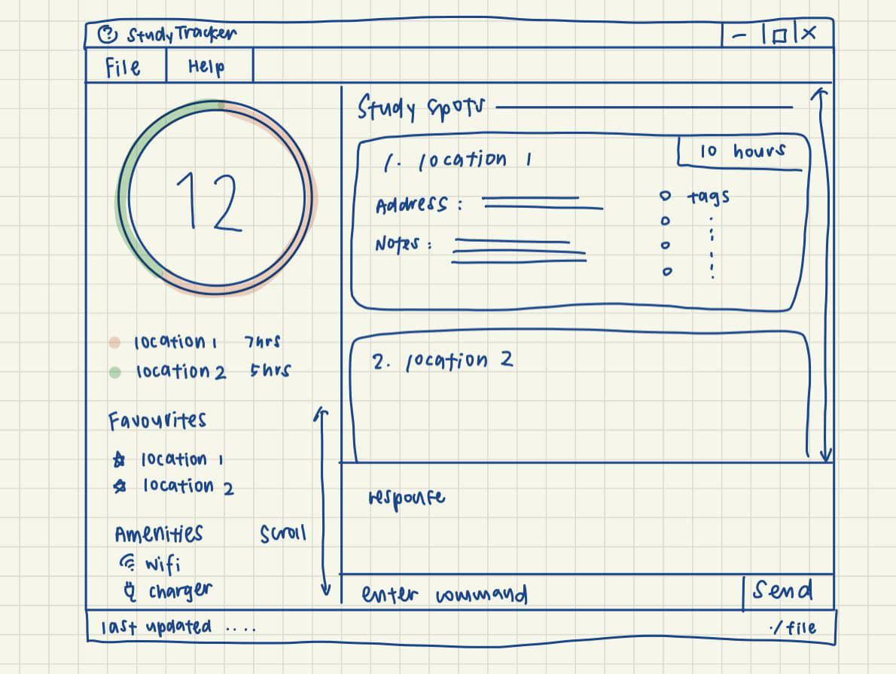

StudyTracker is a **desktop app that lets you save your favourite study spots, optimized for use via Command Line Interface (CLI).** It allows you to keep track of different study spots you’ve visited and record your past experiences at these study spots. Key information such as amenities available can be recorded to plan your future visits.

* Table of Contents
{:toc}

--------------------------------------------------------------------------------------------------------------------

## Quick start

1. Ensure you have Java `11` or above installed in your Computer.

1. Download the latest `StudyTracker.jar` from [here](https://github.com/AY2122S1-CS2103T-T09-1/tp/releases).

1. Copy the file to the folder you want to use as the _home folder_ for your AddressBook.

1. Double-click the file to start the app. The GUI similar to the below should appear in a few seconds. Note how the app contains some sample data.<br>
   

1. Type the command in the command box and press Enter to execute it. e.g. typing **`help`** and pressing Enter will open the help window.<br>
   Some example commands you can try:

   * **`list`** : Lists all study locations.

   * **`add`**` n[COM1] r[5]` : Adds a study location named `COM1` to the StudyTracker.

   * **`delete`**`n[COM1]` : Deletes the location named `COM1` from the StudyTracker.

   * **`clear`** : Deletes all study spots.

   * **`exit`** : Exits the app.

1. Refer to the [Features](#features) below for details of each command.

--------------------------------------------------------------------------------------------------------------------

## Command Syntax [incomplete]

<div markdown="block" class="alert alert-info">

**:information_source: Notes about the command format:**<br>

* Words in `UPPER_CASE` are the parameters to be supplied by the user.<br>
  e.g. in `add n/NAME`, `NAME` is a parameter which can be used as `add n/John Doe`.

* Items in square brackets are optional.<br>
  e.g `n/NAME [t/TAG]` can be used as `n/John Doe t/friend` or as `n/John Doe`.

* Items with `…`​ after them can be used multiple times including zero times.<br>
  e.g. `[t/TAG]…​` can be used as ` ` (i.e. 0 times), `t/friend`, `t/friend t/family` etc.

* Parameters can be in any order.<br>
  e.g. if the command specifies `n/NAME p/PHONE_NUMBER`, `p/PHONE_NUMBER n/NAME` is also acceptable.

* If a parameter is expected only once in the command but you specified it multiple times, only the last occurrence of the parameter will be taken.<br>
  e.g. if you specify `p/12341234 p/56785678`, only `p/56785678` will be taken.

* Extraneous parameters for commands that do not take in parameters (such as `help`, `list`, `exit` and `clear`) will be ignored.<br>
  e.g. if the command specifies `help 123`, it will be interpreted as `help`.

</div>

## Features


### Viewing help : `help`

Provides a link to the full User Guide.


Format: `help`


### Adding a study spot: `add`

Adds a study spot to the StudyTracker.

Format: `add n[NAME]* r[RATING]* a[ADDRESS] t[TAG...] m[AMENITY...]`

<div markdown="span" class="alert alert-primary">:bulb: **Tip:**
Tags, amenities and address are all optional.
</div>

Examples:
```
add n[COM1] r[5]
New study spot “COM1 Basement” added to list!

add n[Starbucks at U-Town] r[4] t[noisy] m[wifi]
New study spot “Starbucks at U-Town” added to list!
```

Command alias: `new`

### Listing all study spots : `list`

Shows all saved study spots in the StudyTracker.

Format: `list`

Examples:
```
list 
Your study spots are:
  1. COM1 Basement
  2. TR3
  3. PC Commons
  4. CLB
```

<div markdown="span" class="alert alert-primary">:bulb: **Tip:**
Make use of command aliases to speed up typing your inputs!
</div>

Command alias :`ls`

### Editing a study spot : `edit`

Edits the details of a single study spot.

Format: `edit n[NAME]* n[NEW_NAME] a[NEW_ADDRESS] t[NEW_TAG] m[NEW_AMENITY] r[NEW_RATING]`

* Edits the study spot with the same name. The name, while not case-sensitive, **must match the name in the list**.
* At least one of the optional fields must be provided.
* Existing values will be updated to the input values.
* When editing tags, the existing tags of the study spot will be removed i.e adding of tags is not cumulative.
* You can remove all the study spot’s tags by typing `t/` without
    specifying any tags after it.

Examples:
```
edit n[tr3] n[Training Room 3]
Study spot “TR3” has been edited to “Training Room 3”
```

Command alias: `ed`

### Locating a study spot by name: `find`

Finds study spots whose names contain the query.

Format: `find n[NAME]*`

* The search is case-insensitive. e.g `hans` will match `Hans`
* The results will contain study spots whose name **contains** the query. e.g. `lib` will give `library`

Examples:
```
find n[lib]
Found the following study spots matching “lib”:
  1. Central Library
  2. Hon Sui Sen Memorial Library
  3. Jurong Library
```

Command alias: `grep`

### Deleting a study spot : `delete`

Deletes the specified study spot from the StudyTracker.

Format: `delete n[NAME]*`

* Deletes the study spot with the specified **name**.


Examples:
```
delete n[COM1]
COM1 has been deleted.
```

Command alias: `rm`

### Clearing all entries : `clear`

Clears all entries from the StudyTracker.

<div markdown="span" class="alert alert-primary">:exclamation: **NOTE:**
This command is irreversible!
</div>

Format: `clear`

Example:
```
clear
All study spots have been cleared.
```

Command alias: `rma`

### Exiting the program : `exit`

Closes the StudyTracker.

Format: `exit`

Example:
```
exit
Goodbye!
```

Command alias: `/q`

### Saving the data

AddressBook data are saved in the hard disk automatically after any command that changes the data. There is no need to save manually.

### Editing the data file

AddressBook data are saved as a JSON file `[JAR file location]/data/addressbook.json`. Advanced users are welcome to update data directly by editing that data file.

<div markdown="span" class="alert alert-warning">:exclamation: **Caution:**
If your changes to the data file makes its format invalid, AddressBook will discard all data and start with an empty data file at the next run.
</div>

### Archiving data files `[coming in v2.0]`

_Details coming soon ..._

--------------------------------------------------------------------------------------------------------------------

## FAQ

**Q**: How do I transfer my data to another Computer?<br>
**A**: Install the app in the other computer and overwrite the empty data file it creates with the file that contains the data of your previous AddressBook home folder.

--------------------------------------------------------------------------------------------------------------------

## Command summary

Action | Format, Examples
--------|------------------
**Add** | `add n[NAME]* r[RATING]* a[ADDRESS] t[TAG...] m[AMENITY...]` <br> e.g., `add n[COM1] r[5]`
**Clear** | `clear`
**Delete** | `delete n[NAME]*` <br> e.g., `delete n[COM1]`
**Edit** | `edit n[NAME]* n[NEW_NAME] a[NEW_ADDRESS] t[NEW_TAG] m[NEW_AMENITY] r[NEW_RATING]`<br> e.g.,`edit n[tr3] n[Training Room 3]`
**Find** | `find n[NAME]*`<br> e.g., `find n[lib]`
**List** | `list`
**Help** | `help`
