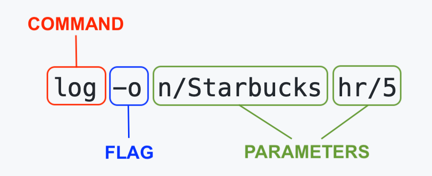
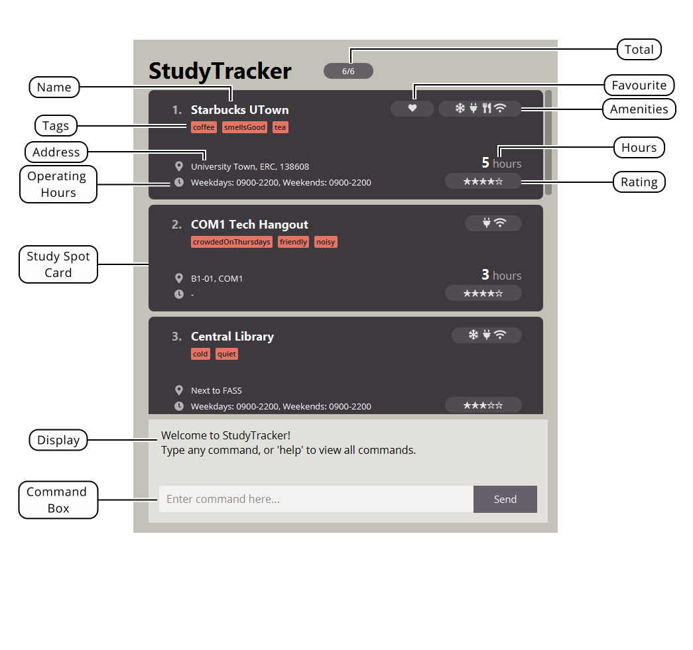
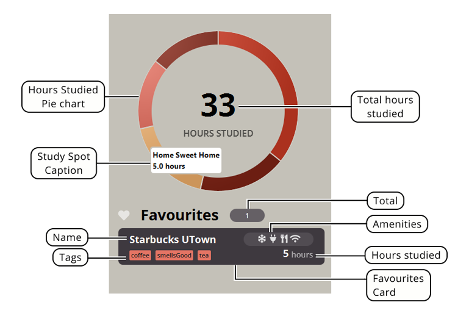
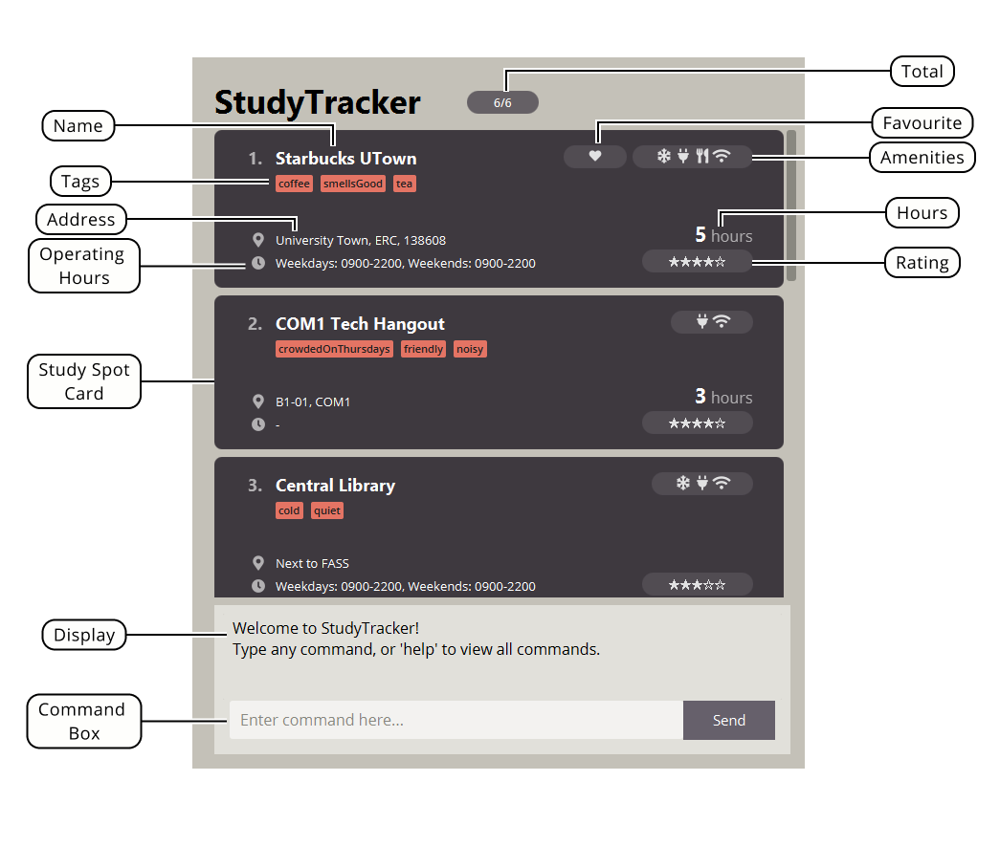
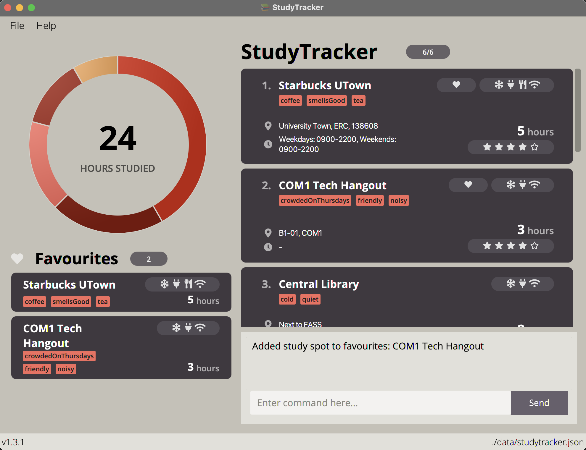
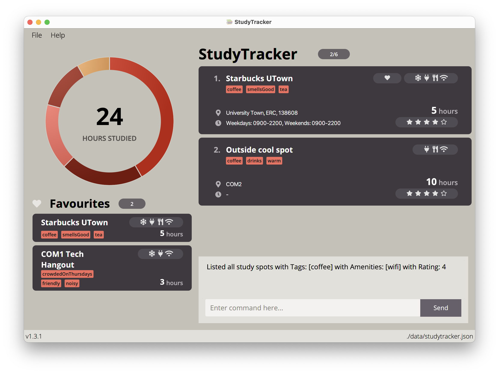
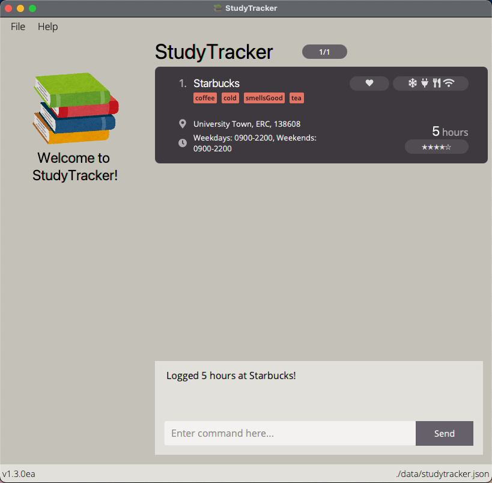
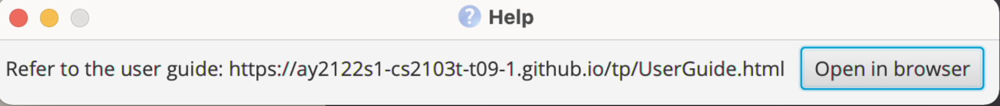

StudyTracker is a **desktop app** that **tracks your most productive study spots**, optimized for students who are familiar with **Command Line Interfaces (CLI)**.

**StudyTracker was built to solve the problem of not finding productive study spots**.
We aim to **maximise students' productivity** by **making it easy to find the best place to study.**

Overview of main features:
- **Make informed decisions** of where to study —  every study spot includes details about amenities like sockets, aircon, and crowd level, and more!
- **Data-driven statistics** to **track time spent studying** ensures you know where to go to be productive
- Made a mistake? Found out something new? **Editing details is quick and simple!**
- **Powerful customization** with user-defined aliases and custom themes!
- **Built for cross-platform use** with JavaFX. Bring your StudyTracker data with you to any Windows, Mac, or Linux device!

StudyTracker is full of features, but don't worry!
This **User Guide** provides clear, step-by-step information to use StudyTracker. If this is your first time using StudyTracker, [**How to use this guide**](#how-to-use-this-user-guide) is the perfect place to start.

**Open up StudyTracker, and let's get on the right track to productivity!**

Want to contribute to development? Check out the [**Developer Guide**](DeveloperGuide.html) instead.

## **Table of Contents**

* Table of Contents
{:toc}

## **Quick Start**

StudyTracker comes with sample data.
In this **Quick Start** section, we'll go through **a tutorial to try the essential features of StudyTracker.**

Let's explore how we **add a new study spot** and **track our study time** with it:

1. Ensure you have Java `11` or above installed in your Computer.

1. Download the latest `StudyTracker.jar` from [here](https://github.com/AY2122S1-CS2103T-T09-1/tp/releases).

1. Copy the file to the folder you want to use as the _home folder_ for your StudyTracker.

1. Double-click the file to start the app. The GUI similar to the one below should appear in a few seconds. Note how the app contains some sample data. 

    
      _Figure 1 - GUI of StudyTracker_

1. Type the command in the [**command box**](#command-box) and press Enter to execute it. e.g. typing **`help`** and 
   pressing Enter will open the help window. 

    Do the following commands in sequence:

   1. **`list`** : Lists all study spots.
    Study spots are shown in cards on the right panel of the program.

   1. **`add`** `n/FASS Benches r/5 m/wifi` : **Adds a study location** named `FASS Benches`, with a rating of 5 and 'wifi' amenity to the StudyTracker.
   You'll see it if you scroll down the list of study locations!

   1. **`log`** `n/FASS Benches hr/3` : **Logs 3 hours of study time** at `FASS Benches`.
    The card will update with the new study hours. Notice how the pie chart on the left of the GUI updates with the hours spent!
    Try hovering over the pie chart to find your newly-added study spot!

   1. **`exit`** : Exits the app.

1. Congratulations! You've just added a new study spot, and logged your study time!
You're on the right track to productivity!

1. Refer to the [**Features**](#features) section for more commands and features in StudyTracker.

:bulb: **Tip:** 
Check out **<a href="#command-structure">How to read Commands in StudyTracker</a>** section if you are unfamiliar 
with CLI syntax!

## **How to use this User Guide**

This section provides tips on reading this document, as well as how to navigate it.

This User Guide is structured so that it is easy for you to find what you need.
If this is your first time using StudyTracker, don't worry! You will have no problems using our app as long as 
you read this User Guide in order, starting from this section.

We recommend you to have the StudyTracker application open, so you can try out the commands and features as you go 
along!

The [**Table of Contents**](#table-of-contents) contains links to all the sections of the guide.

[**Common Symbols found in this guide**](#common-symbols-found-in-this-guide) and [**How to read Commands in StudyTracker**](#how-to-read-commands-in-studytracker) section will help you understand this document better.
You can then look at the [**GUI Layout**](#gui-layout) and [**Features**](#features) sections for clear instructions for using StudyTracker.

### Common Symbols found in this guide

| Symbol | Description |
| --- | ----------- |
| :information_source: | This symbol indicates that something important to take note of. |
| :bulb: | This symbol indicates that we are mentioning a tip. |
| :warning: | This symbol indicates something to be careful of. |
| :small_red_triangle: | This symbol indicates where you can go back to the top (Table of Contents) |

### How to read Commands in StudyTracker

Throughout the User Guide, you'll see commands to enter into StudyTracker.
Here is how to read the command format:

#### Command Structure

Commands use a multipart structure that must be specified in this order:
1. **Command word** which may be user-created aliases (detailed further in [**Aliases**](#setting-command-aliases)).  
2. **Parameters** and **Flags**. A command may have more than one flag and/or parameters.

  _Figure 2 - Command Structure_

#### Flags

Commands may contain **flags**. All flags are optional.
  Flags are represented by a dash, and a sequence of characters.  
  e.g. the `list` command has a `-f` flag to list only favourites.

Here is a list of common flags used.

Flags | Features that support these flags
--------|------------------
Favourite `-f` | `list`
Amenities `-m` | `list`
Rating `-r` | `list`
Tags `-t` | `list`
Override `-o` | `log`
Reset `-r` | `log`
Reset All `-ra` | `log`
Show `-s` | `alias`

:information_source: **Note:**
Flags may differ in meaning depending on the command word used. 

#### Parameters

* Each parameter may have a delimiter.  
e.g. the `NAME` parameter has a delimiter `n/` and the `AMENITY` parameter has a delimiter `m/`.

* You will supply words in `UPPER_CASE` as the parameters. 
  e.g. in `add n/NAME*`, `NAME` is a parameter which can be used as `add n/COM1 Basement`.

* You are **required** to enter parameters with an asterisk `*`, while those without an asterisk are 
  optional. 
  e.g You can use `n/NAME* m/AMENITY...` as `n/COM1 Basement m/wifi` or as `n/COM1 Basement`.

* Parameters with `…`​ after them can be used multiple times including zero times. 
  e.g. You can use `t/TAG...​` as ` ` (i.e. 0 times), `t/noisy`, `t/mosquitos t/sunny` etc.

* Parameters can be in any order. 
  e.g. if the command specifies `n/NAME* a/ADDRESS`, `a/ADDRESS n/NAME*` is also acceptable.

:warning: **Caution:**

* If a parameter is expected only once in the command, but you specified it multiple times, only the **last occurrence** of the parameter will be taken. 
  e.g. if you specify `n/COM1 n/CLB`, StudyTracker will only take `n/CLB`.

* Extraneous parameters for commands that do not take in parameters (such as `help`, `exit` and `clear`) will be ignored. 
  e.g. if the command specifies `help 123`, it will be interpreted as `help`.

Here is a list of common delimiters used.

Delimiters | Features that support these delimiters
--------|------------------
Name `n/` | `add`, `edit`, `fav`, `unfav`, `delete`
Spot `spot/` | `edit`
Address `a/` | `add`, `edit`
Operating Hours `o/` | `add`, `edit`
Studied Hours `hr/` | `add`, `log`
Rating `r/` | `add`, `edit`, `list`
Amenity `m/` | `add`, `edit`, `list`
Tag `t/` | `add`, `edit`, `list`
Remove tag `rt/` | `edit`
Remove amenity `rm/` | `edit`
Alias `al/` | `alias`, `unalias`
Command `cmd/` | `alias`, `unalias`

[:small_red_triangle: **Back to Top**](#table-of-contents)

### How to use these Commands in Command Line Interface

If this is your first time using *Command Line Interface (CLI)*, fret not and we will guide you step-by-step on how to use CLI!

You tell the *Command Line Interface* exactly what you want it to do! However, if you input something that the CLI does not understand, 
then the program will not be able to help you. Inputs that the CLI understand are called **valid**, while those that are not understood are
called **invalid**.

Some **valid** user inputs for the [**add command**](#adding-a-study-spot-add) are provided below:
* `add n/PC Commons a/UTown t/veryCrowded m/wifi r/4`
* `add n/COM2 Basement r/3` (optional arguments are not required)
* `add n/TR3 r/4 a/Yusof Ishak House m/wifi m/aircon` (multiple amenities are acceptable)

Some **invalid** user inputs for the [**add command**](#adding-a-study-spot-add) are provided below:
* `add n/PC Commons` (missing `RATING` parameter)
* `add PC Commons /UTown /very crowded /toilet /4*` (delimiters and slashes missing from parameters, unnecessary asterisk added outside of parameters)
* `n/PC Commons a/UTown r/4` (missing command word `add`)

If you accidentally entered a wrong command, don't worry! A comprehensive error message will show up 
in the display immediately to guide you to entering the correct command.

1. In the [**Graphical User Interface Layout**](#gui-layout), the [**Command Box**](#command-box) can be found at the 
   bottom. 
   This is where you will
tell the program what to do.
   
1. Click on the box that says "Enter command here...", and simply type in whatever input you want.

1. Press enter (or click the send button) to submit the command to the program. Remember that the input should be valid! Or else
the program will not know what to do 😢.
   
1. After pressing enter, your command has successfully been given to StudyTracker to be processed! You have just successfully **executed** a command.

Congratulations! 🎉 You should now know how to use CLI. Now all you need to know are the **commands** you can give to the CLI to play around with it.

## **GUI Layout**

This section introduces the Graphical User Interface (GUI) of StudyTracker.

_Figure 3 - GUI Layout_

The top of the interface contains the **Menu Bar**. Clicking on `File` or `Help` will open up the [**Settings menu**](#managing-themes) and the [**Help window**](#viewing-help--help) 
respectively.

On the left side of the interface, you can find the [**Info Display**](#info-display).

On the right side of the interface, you can find the [**Study Spot List**](#study-spot-list) and [**Command Box**](#command-box).

:bulb: **Tip:**
Check out <a href="#managing-themes">**Managing Themes**</a> section to change the theme of the GUI!

### Info Display

The **Info Display** contains the **Pie Chart** and **Favourites List**.

_Figure 4 - Info Display Layout_

The **Hours Studied Pie Chart** displays statistics of time spent studying at the *top five* study spots in terms of 
the number of hours studied.

* Moving your cursor over any segment of the pie chart will show a `Study Spot Caption` with details of the corresponding study spot
* `Total hours studied` will show the total number of hours studied over all study spots

The **Favourites List** contains **Cards** representing all [**favourited**](#adding-a-study-spot-to-favourites-fav) study spots in StudyTracker.
The `Total` tag at the top shows total number of favourited study spots in StudyTracker.

* `Name` — name of study spot
* `Tags` — user-defined tags for the study spot
* `Amenities` — the icons represent the amenities present in study spot.
From left to right, the amenities are **aircon, charger, food, wifi**.
* `Hours studied` — total number of hours studied at study spot

### Study Spot List

_Figure 5 - Study Spot List Layout_

The **Study Spot List** contains **Cards** representing every study spot in StudyTracker.
The `Total` tag at the top shows current visible study spots/total number of study spots in StudyTracker.
Scroll down the list to view all the study spots!
* `Name` — name of study spot
* `Tags` — user-defined tags for the study spot
* `Address` — address of study spot
* `Operating Hours` — operating hours of study spot on weekdays and weekends 
* `Favourite` — this icon indicates the study spot is a favourite
* `Amenities` — the icons represent the amenities present in study spot.
From left to right, the amenities are **aircon, charger, food, wifi**.
* `Hours` — total number of hours studied at study spot
* `Rating` — user-defined rating for the study spot out of 5

### Command Box 

The **Command Box** is where you can enter [**commands**](#how-to-read-commands-in-studytracker) in StudyTracker.

* `Command Box` — type in your commands here
* `Display` — results of commands and error messages are shown here.

:bulb: **Tip:**
Similar to any CLI, you can navigate the history of commands you entered with UP and DOWN arrow keys.

[:small_red_triangle: **Back to Top**](#table-of-contents)

## **Features**

This section introduces all the features in StudyTracker.

Features are grouped according to usage.
Click on the groups to view clear, step-by-step usage instructions!

:information_source: **Note:**
To get the expected outputs we stated in this guide exactly, please use the app's default data. Also, please enter 
the inputs by following the sample inputs provided in the features section sequentially (except for the `clear` command).

| Features | Usage and commands|
|----------|------------------ |
| **[Managing study spots](#managing-study-spots)** | Commands that manage the study spots in this app   **Commands**: `add`, `edit`, `fav`, `unfav`, `delete`, `clear` |
| **[Managing StudyTracker list](#managing-studytracker-list)** | Commands to filter and view specific study spots   **Commands**: `list`, `find` |
| **[Logging study hours](#logging-study-hours-log)**| Commands to log study hours   **Commands**: `log` |
| **[Setting aliases](#setting-command-aliases)**| Commands to create and remove aliases   **Commands**: `alias`, `unalias` |
| **[Viewing help](#viewing-help--help)** | View the built-in help manual   **Commands**: `help` |
| **[Exiting the program](#exiting-the-program--exit)**| Exit StudyTracker   **Commands**: `exit` |
| **[Managing themes](#managing-themes)**| Customize the look of StudyTracker |
| **[Data](#data)** | Manage and save user data and user preferences |

### Managing study spots 

#### Adding a study spot: `add`

Found a new study spot? You can add the study spot to your StudyTracker by making use of the `add` command.

**Format:** `add n/NAME* r/RATING* a/ADDRESS t/TAG... m/AMENITY... o/OPERATING_HOURS`

* Adds a study spot with `NAME`.
* You can only add amenities from this list of 4 amenities: `wifi`, `food`, `charger`, `aircon`. Any other amenities 
  entered will give you an error message. 
* You can only enter tags that are one-word long. If you wish to use more than one word, you can use Camel Case 
  (e.g. `t/veryCrowded`) 
* You can only enter ratings that are integers from 0 to 5, inclusive. 
* You can indicate that a study spot closes on the next day by entering a closing hour that is earlier than
  the opening hour.
* You can indicate that a study spots opens for 24 hours by entering identical opening and closing hours.

:information_source: **Note:**
Tags, amenities, address and operating hours are all optional.

:bulb: **Tip:**
Not sure how to use the Command Line Interface? Check <a 
href="#how-to-use-these-commands-in-command-line-interface">**this**</a> guide out!

:warning: **Caution:**
Name cases will be reflected in the interface upon adding, however the name will be case-insensitive in future 
commands for an existing study spot.
Hence you cannot add a StudySpot with the same name and a different case e.g. If "Central Library" is already in StudyTracker,
you cannot add "central library".

**Examples:** You can try executing the commands in the **input** rows and check if you get the corresponding **output**!

| Input | Output |
|---- |---- |
|`add n/COM1 Basement r/5`| New study spot added: COM1 Basement; Rating: 5|
|`add n/Starbucks at UTown r/4 t/noisy m/wifi o/0800-2000,0900-2200`| New study spot added: Starbucks at UTown; Rating: 4; Operating Hours: Weekdays: 0800-2000, Weekends: 0900-2200; Tags: [noisy]; Amenities: [wifi]|

#### Editing a study spot : `edit`

If you made a mistake in your `add` command, or wish to change the details of a study spot due to newly-discovered 
amenities, 
you can easily do so by making use of the `edit` command!

**Format:** `edit spot/NAME* n/NEW_NAME a/NEW_ADDRESS t/NEW_TAG m/NEW_AMENITY r/NEW_RATING o/NEW_OPERATING_HOURS rt/OLD_TAG rm/OLD_AMENITY`

* Edits the study spot matching `NAME`.
  The provided `NAME` is case-insensitive and **must fully match the study spot name**.
* You must provide **at least one** of the optional fields.
* StudyTracker will update the details of the given study spot with any provided `NEW_NAME`, `NEW_ADDRESS`, 
  `NEW_RATING`, `NEW_AMENITY`, `NEW_TAG` and `NEW_OPERATING HOURS`, while removing any provided `OLD_TAG` and 
  `OLD_AMENITY`.
* When editing tags and amenities, using `t/` or `m/` will be adding on top of existing tags and amenities.
* You can remove a specific tag or amenity with the `rt/` or `rm/` parameter respectively.
* You can remove all the study spot’s tags by typing `t/` or `m/` respectively without
  specifying any tags after it.

**Examples:** You can try executing the commands in the **input** rows and check if you get the corresponding **output**!

| Input | Output |
|---- |---- |
|`edit spot/COM1 Basement n/Basement`|Edited study spot: Basement; Rating: 5|
|`edit spot/outside cool spot r/4 t/coffee`|Edited study spot: Outside cool spot; Rating: 4; Address: COM2; Studied Hours: 10; Tags: [warm][drinks][coffee]; Amenities: [wifi][charger][food]|
|`edit spot/home sweet home t/`|Edited study spot: Home Sweet Home; Rating: 1; Address: 42 Wallaby Way; Amenities: [wifi][charger]|

:information_source: **Note:**
The above first input and output pair assumes that there is already a study spot named "COM1 Basement" in the Study Tracker!
This input only changes the name from "COM1 Basement" to "Basement". Outputs may differ based on what information 
your original study spot already has. 

#### Adding a study spot to Favourites: `fav`

Really enjoyed studying somewhere? You can add this study spot to your favourites by using the `fav` command! This will 
make the Study Spot appear in the [**Favourites List**](#info-display), reminding you of your favourite study spots 
every 
time you open StudyTracker.

:information_source: **Note:**
Don't forget to add the spot to your StudyTracker before using the fav command! 

**Format:** `fav n/NAME*`

**Examples:** You can try executing the commands in the **input** rows and check if you get the corresponding **output**!

| Input | Output |
|---- |---- |
|`fav n/COM1 Tech Hangout`|Added study spot to favourites: COM1 Tech Hangout|

_Figure 6 - Example of Adding Favourites_

#### Removing a study spot from Favourites: `unfav`

Did one of your favourite study spots suddenly decide to ban students from studying there, and you decide it is time to unfavourite a spot?
You can make use of the `unfav` command to do so.

:information_source: **Note:**
The study spot you are trying to unfavourite should originally be a favourite!

**Format:** `unfav n/NAME*`

**Examples:** You can try executing the commands in the **input** rows and check if you get the corresponding **output**!

| Input | Output |
|---- |---- |
|`unfav n/com1 tech hangout`|Removed study spot from favourites: COM1 Tech Hangout|

#### Deleting a study spot : `delete`

Decided that you never want to go back to a study spot as it was extremely unconducive for studying? You can use the 
`delete`command to do so.

**Format:** `delete n/NAME*`

* Deletes the study spot matching `NAME`.
  The provided `NAME` is case-insensitive and **must fully match the study spot name**.

**Examples:** You can try executing the commands in the **input** rows and check if you get the corresponding **output**!

| Input | Output |
|---- |---- |
|`delete n/Basement`|Deleted study spot: Basement|

#### Clearing all entries : `clear`

Moving to a new location and decide to start your list afresh? You can make use of the `clear` command to clear the entire list of
study spots.

:warning: **Caution:**
This command is irreversible!

**Format:** `clear`

**Example:** You can try executing the commands in the **input** rows and check if you get the corresponding **output**!

| Input | Output |
|---- |---- |
|`clear`|StudyTracker has been cleared!|

:bulb: **Tip:**
If you wish to clear all your study spots while keeping the data you originally stored, you can make a copy of [home 
folder]/data/studytracker.json

[:small_red_triangle: **Back to Top**](#table-of-contents)

### Managing StudyTracker list

#### Listing study spots : `list`

Want to find all the study spots that have the amenity "aircon"? Or perhaps list all the study spots you tagged with 
"freeWater"? You can make use of the `list` command and its various different [**flags**](#flags) to get what you want. 
  Note that the results of the `list` command will only contain StudySpots that matches **ALL** the 
specifications provided by the user. 

Below shows the corresponding [**flag**](#flags) to its function.

| Flag     | Function |
| ----------- | ----------- |
| No flag (i.e. `list`)      | Lists out all study spots (clears any filters previously applied)       |
| `-f`   | Shows all favourited study spots        |
| `-t t/TAG...` | Shows all study spots with the specified tags |
| `-m m/AMENITY...` | Shows all study spots with the specified amenities |
| `-r r/RATING` | Shows all study spots with the specified rating |

:information_source: **Note:**
You can use multiple flags at once.

**Examples:** You can try executing the commands in the **input** rows and check if you get the corresponding **output**!

| Input | Output |
|---- |---- |
|`list`|Listed all study spots|
|`list -t t/coffee -m m/wifi -r r/4`|Listed all study spots with Tags: [coffee] with Amenities: [wifi] with Rating: 4|

_Figure 7 - Example of listing study spots with wifi, coffee tag and rating of 4_

:bulb: **Tip:**
Make use of [**command aliases**](#setting-command-aliases) to speed up typing your inputs!
Default Command alias for `list`: `ls`

#### Locating a study spot by name: `find`

Trying to find a study spot by its name? You can use the `find` command to easily do so!

**Format:** `find KEYWORD* MORE_KEYWORDS...`

* The search is case-insensitive. e.g `library` will match `Library`
* StudyTracker will only match full words. e.g. `Lib` will not match `Library`
* StudyTracker will return study spots matching at least one keyword.
* For example, `find library spot` will match `Central Library` and `Cool Spot` as both the search results for `library` and `spot` are shown.

**Examples:** You can try executing the commands in the **input** rows and check if you get the corresponding 
**output**! Note that the specific number of study spots listed may differ from what you see, depending on what 
study spots you have. 

| Input | Output |
|---- |---- |
|`find library`|2 study spot(s) listed!|

[:small_red_triangle: **Back to Top**](#table-of-contents)

### Logging study hours: `log`

After studying at a certain study spot, you can `log` how many hours you have studied at this location.
There are also various flags you can use to reset or override hours to the value of your choice.
Use the `-r`, `-o` or `-ra` flags respectively, as shown below:

| Format     | Function |
| ----------- | ----------- |
| `log n/NAME* hr/NUM_OF_HOURS*` | Adds the given `NUM_OF_HOURS` to the original studied hours at a study spot |
| `log -o n/NAME* hr/NUM_OF_HOURS*` | Overrides the current studied hours with the given `NUM_OF_HOURS`  |
| `log -r n/NAME*` | Resets the number of studied hours at a study spot to 0 |
| `log -ra` | Resets studied hours of **ALL** study spots to 0 |

:information_source: **Note:**
As long as the flag `-ra` is present in the command, hours for all study spots will be reset to 0.  

**Example:** You can try executing the commands in the **input** rows and check if you get the corresponding **output**!

| Input | Output |
|---- |---- |
|`log n/Starbucks UTown hr/2`|Logged 2 hours at Starbucks UTown!|
|`log -o n/Starbucks UTown hr/5`|Changed hours to 5 at Starbucks UTown!|
|`log -r n/Starbucks UTown`|Reset hours at Starbucks UTown!|
|`log -ra`|Reset hours for all study spots!|

_Figure 8 - Example of Log command_

Logging 2 hours to 'Starbucks UTown' with the command `log n/starbucks utown hr/2` (as seen in Input 1) would update the **study spot card**, as well as statistics on the **pie chart**.

:bulb: **Tip:**
Use the log command at the end of a study session to keep track of how long you studied somewhere!

[:small_red_triangle: **Back to Top**](#table-of-contents)

### Setting Command Aliases

#### Adding command aliases : `alias` 

Do you find yourself using certain commands so often that you wish you could "code-name" it so you don't need to type so much? 
Alias is the command for you. The `alias` command can help you to shorten input commands to whatever you want it to be. 

:information_source: **Note:**
Aliases are case-sensitive! 

| Format     | Function |
| ----------- | ----------- |
| `alias -s` | Shows all aliases that you have set |
| `alias al/ALIAS* cmd/COMMAND*` | Sets and alias, where `ALIAS` is the shortcut and `COMMAND` is the given input you wish to alias  |

**Example:** 

| Input     | Output | Usage of Alias | Output |
| ----------- | ----------- | ---------- | ------------- |
| `alias al/ml cmd/list` | Added alias ml: [list] | `ml` | `Listed all study spots` |

* running `ml` will run the `list` command.

:bulb: **Tip:**
You can chain aliases to make more powerful commands! See the below example. 

**Example:**  

| Input     | Output | Usage of Alias | Output |
| ----------- | ----------- | ---------- | ------------- |
| `alias al/LogCLB cmd/log n/Central Library hr/` | Added alias LogCLB: [log n/Central Library hr/] | `LogCLB 3` | `Logged 3 hours at Central Library!`|

Running `LogCLB 3` would then result in `log n/Central Library hr/3`, allowing you to log a variable number of study hours to 'Central Library'!

#### Removing command aliases: `unalias`

If you do not like an alias you originally set, you can use `unalias` to remove that alias.

**Format:** `unalias al/ALIAS*` to remove alias

**Example:**

| Input | Output |
|---- |---- |
|`unalias al/ml`|Removed alias 'ml'|

[:small_red_triangle: **Back to Top**](#table-of-contents)

### Viewing help : `help`

Forgot a command? You can make use of the `help` command to get a quick overview of all commands available in StudyTracker!

Click on each command on the left panel to view usage instructions of each command.

You can also visit the User Guide and Developer Guide by clicking on the buttons in the window.

_Figure 9 - Help Window_

Format: `help`

:bulb: **Tip:**
View the help window anytime by using the F1 shortcut!
Alternatively, click on 'Help' in the menu bar!

### Exiting the program : `exit`

Hands off the mouse and want to quickly close the app without getting your hands off the keyboard? Simply execute the `exit` command!

**Format:** `exit`

[**Default Command alias:**](#setting-command-aliases) `bye`, `quit`

### Managing Themes
Personality matters, and you should be given a way to select a theme that speaks to you!

From `File > Settings`, select the colour theme you wish to use. Themes are saved in your user preferences, so the next time you 
launch the application, rest assured that your colour theme will be set and ready to go!

_Figure 10 - Themes available_

[:small_red_triangle: **Back to Top**](#table-of-contents)

### Data

#### Saving data

StudyTracker's data is saved in the hard disk automatically after any command that changes the data. You can rest assured that you do
not need to save your data manually.

#### Editing the data file

StudyTracker data are saved as a JSON file `[home folder]/data/studytracker.json`. Advanced users are welcome to update data directly by editing that data file.

:warning: **Caution:**
If your changes to the data file makes its format invalid, StudyTracker will discard all data and start with an empty data file at the next run.

[:small_red_triangle: **Back to Top**](#table-of-contents)

## **FAQ**

This section contains frequently asked questions (FAQs) about StudyTracker.

**Q**: How do I transfer my data to another Computer? 
**A**: Install the app in the other computer and overwrite the empty **data** file it creates with the file that contains the data of your previous StudyTracker home folder.
You may also copy the **preferences.json** file to keep your user preferences.

**Q**: How should tags be used?  
**A**: Tags are short bites of information about study spots. It is up to you to define how you use them. One way is 
to use `list` to filter for study spots with a specified tag. You can refer to [**List**](#listing-study-spots--list) 
for more details.

**Q**: How do I receive updates for this app?  
**A**: Currently, the app does not automatically update. You can check out the latest version [**here**](https://github.com/AY2122S1-CS2103T-T09-1/tp/releases). Simply replace your current JAR file with the latest version.

**Q**: Can I contribute to the code as well?  
**A**: Yes, of course! We're open-source and are open to new ideas. You can contact anyone in the team on [**Github**](https://github.com/AY2122S1-CS2103T-T09-1/tp) and create a pull request [**here**](https://github.com/AY2122S1-CS2103T-T09-1/tp/pulls).

**Q**: What do I do when I encounter bugs? 
**A**: As much as possible, we rigorously test our application before it is released. However, should you encounter 
bugs, you can raise issues to our team [**here**](https://githubcom/AY2122S1-CS2103T-T09-1/tp/issues) 
and we would 
look to fix them in upcoming patches.

[:small_red_triangle: **Back to Top**](#table-of-contents)

## **Glossary**

Term | Definition
-----------|------------------
Command Line Interface (CLI) | A user interface that accepts text input to execute commands.
Graphical User Interface (GUI) | A user interface that uses icons, menus and a mouse to interact with the system.
Syntax | The grammar that all commands follow for our software to understand it.   Click [**here**](#how-to-read-commands-in-studytracker) where we break it down for you!
Flags | Represented by a dash and a sequence of characters, flags modify the operation of a command and are sometimes called options.   e.g. `-f` in the command `list -f` to list favourites
Parameters | Text used to specify information for a command needed to execute.
Delimiters | A sequence of characters used to specify places in a command where a parameter is given.

[:small_red_triangle: **Back to Top**](#table-of-contents)

## **Command summary**

Action | Format, Examples
--------|------------------
**Add** | `add n/NAME* r/RATING* a/ADDRESS t/TAG... m/AMENITY... o/OPERATING_HOURS`   e.g. `add n/COM1 r/5`
**Edit** | `edit spot/NAME* n/NEW_NAME a/NEW_ADDRESS t/NEW_TAG m/NEW_AMENITY r/NEW_RATING o/NEW_OPERATING_HOURS rt/OLD_TAG rm/OLD_AMENITY`  e.g.,`edit spot/tr3 n/Training Room 3`
**Favourite / Unfavourite**  |  `fav n/NAME*` / `unfav n/NAME*`   e.g. `fav n/COM1` / `unfav n/COM1`
**Delete** | `delete n/NAME*`   e.g. `delete n/COM1`
**Clear** | `clear`
**List** | `list -f -t t/TAG... -m m/AMENITY... -r r/RATING`   e.g. `list -f -t t/quiet -m m/wifi -r r/5`
**Find** | `find KEYWORD* MORE KEYWORDS...`  e.g. `find library`
**Log** | `log -o n/NAME* hr/NUM_OF_HOURS*`   e.g. `log -o n/Starbucks hr/5`
**Alias / Unalias** | `alias al/ALIAS* cmd/COMMAND*` / `unalias al/ALIAS*`  e.g. `alias al/home cmd/find home` / `unalias al/ml`
**Help** | `help`
**Exit** | `exit`

[:small_red_triangle: **Back to Top**](#table-of-contents)

