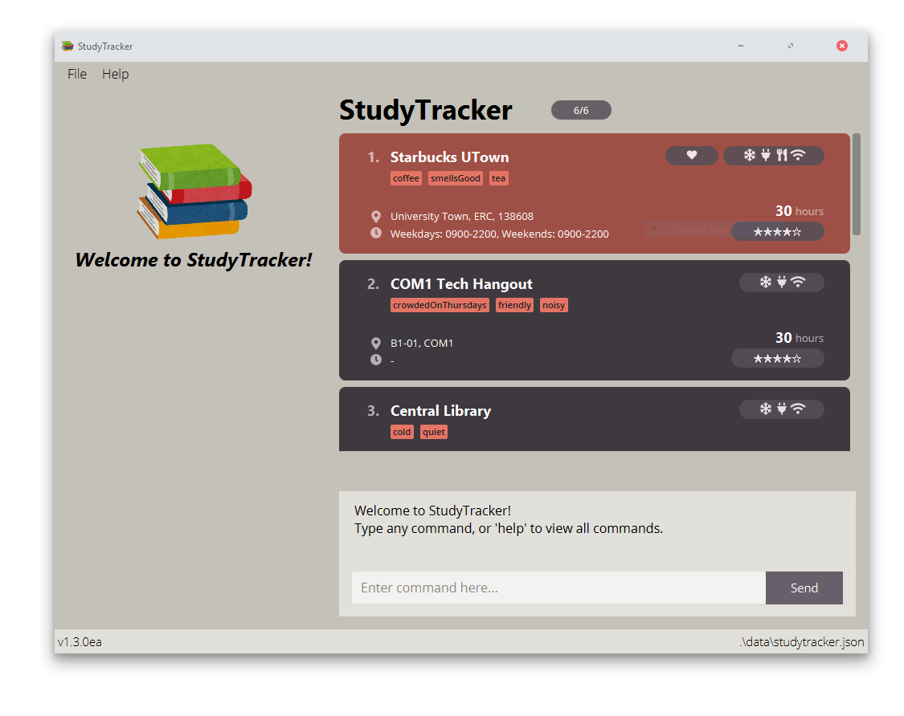

**StudyTracker is a desktop application that maximises your productivity by making it easy to find the best places to study.**

StudyTracker is optimized for use via Command Line Interface (CLI).
Easy to learn, yet powerful when mastered with various customizations.

* If you are interested in using StudyTracker, head over to the [_Quick Start_ section of the **User Guide**](UserGuide.html#quick-start).
* If you are interested about developing StudyTracker, the [**Developer Guide**](DeveloperGuide.html) is a good place to start.

**Acknowledgements**

* Libraries used: [JavaFX](https://openjfx.io/), [Jackson](https://github.com/FasterXML/jackson), [JUnit5](https://github.com/junit-team/junit5)
* Images and icons used are [credited here](https://github.com/AY2122S1-CS2103T-T09-1/tp/blob/master/copyright.txt).
